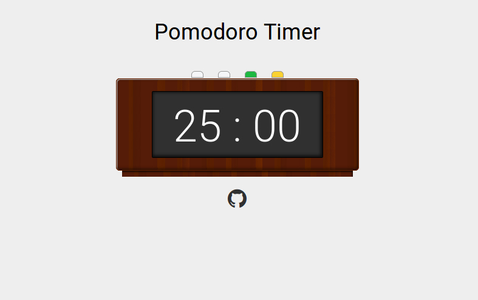

## Vuejs Pomodoro Clock ##
 A simple clock that allows you to implelment the [pomodoro technique](https://en.wikipedia.org/wiki/Pomodoro_Technique).

 

 I built this for FreeCodeCamp's Advanced Front-End Dev challenge on the way to earning my Front-End
 certification. A working demo of this project can be found __[here](https://codepen.io/source-decay/full/vJgLwp/)
__.

 Right now, it only tracks the "work" section of the pomodoro but I will be working to add in the "rest"
 section of the pomodoro as well.

 ### Installation ###
 1. This project relies on SASS/SCSS to compile into CSS. In my environment, I am using SASS in the form of
 a Ruby gem but there are other ways of getting SASS.

 ```sh
 sudo apt install Ruby

 sudo gem install sass --no-user-install
 ```

 2. Clone this directory and enjoy (Vuejs and FA are hosted via CDN so no need to download and set those up
   as well).

 __Please Note__: when working with this project, you will need to make sure to use `sass --watch` in a terminal
 and leave it open in the background so that your SCSS will compile as you go. For example:

 ```sh
 sass --watch PATH/TO/YOUR/SCSS/FILE.SCSS:PATH/TO/WHERE/CSS/WILL/LIVE.CSS
 ```

### UI ###
The left two buttons on the clock increase or decrease your work time. The green button starts the countdown,
the red one pauses the countdown and the yellow resets the clock.

### Future Plans ###
* calculate "rest" time based on "work" time
* move the clock out to an actual Vue component file for the sake of tidiness
